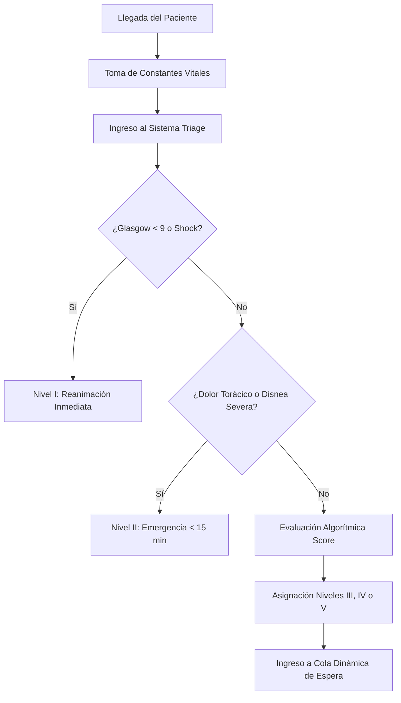

# Flujograma de Admisión y Triaje

```mermaid
flowchart TD
    A[Llegada del Paciente] --> B[Toma de Constantes Vitales]
    B --> C[Ingreso al Sistema Triage]
    C --> D{¿Glasgow < 9 o Shock?}
    D -- Sí --> E[Nivel I: Reanimación Inmediata]
    D -- No --> F{¿Dolor Torácico o Disnea Severa?}
    F -- Sí --> G[Nivel II: Emergencia < 15 min]
    F -- No --> H[Evaluación Algorítmica Score]
    H --> I[Asignación Niveles III, IV o V]
    I --> J[Ingreso a Cola Dinámica de Espera]
```
